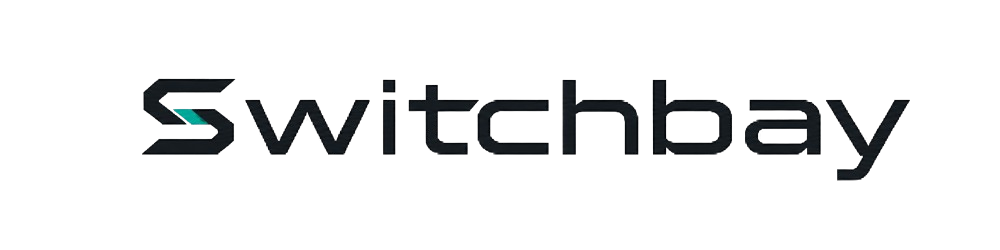

  
  <h1 style="margin: 50;">Switchbay: Engine Bay</h1>

Engine parts and templates for **Switchbay** — a terminal-first AI coding workbench built for developers who demand cloud intelligence, local control, and provider independence without sacrificing their workflow.

- [FAQ](#faq)
- [What's Inside](#whats-inside)
- [How you can contribute](#how-you-can-contribute)

---

## FAQ

**What's Switchbay?:**
> Switchbay is a terminal-first AI coding workbench designed for developers who want cloud intelligence, local control, and provider independence without compromising their workflow. It empowers developers to build, customize, and deploy applications seamlessly.

**What's Engine Bay?:**
> Engine Bay is a collection of essential engine components and templates that power Switchbay's extensible architecture. It provides the building blocks for developers to create, customize, and deploy applications with confidence.

**How it's built:**
> Engine Bay is built using a combination of modern programming languages and frameworks, ensuring compatibility and performance across different platforms. The components are designed to be lightweight, efficient, and easy to integrate into existing workflows. The architecture is modular, allowing developers to pick and choose the components they need for their specific use cases.

**Why Engine Bay Matters:**
> Engine Bay is crucial for developers seeking to leverage Switchbay's capabilities. It offers a structured environment for building applications, ensuring that developers can focus on coding rather than infrastructure. With Engine Bay, developers can streamline their workflow, enhance productivity, and maintain control over their development process.

---

## What's Inside

Inside of this repository, you'll find a variety of engine parts and templates that serve as the foundation for building applications with Switchbay. These components are designed to be modular, reusable, and adaptable to different development needs. 

**Languages Included:**
- 
- 
-  
---

## Closed Contributions

Switchbay is currently closed to external contributions. As we continue to develop and refine the platform, we will provide updates on when and how external contributions can be made. We appreciate your interest and support in making Switchbay a powerful tool for developers.

---

*Switchbay: Terminal-first. Developer-first. Provider-agnostic.*
